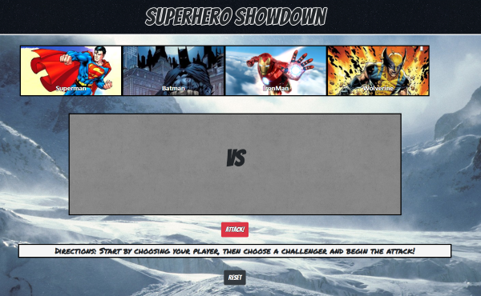

# **Superhero Showdown** 

The user will select a character and must then go through the gauntlet and fight the other heros. The trick of the game is determing the order in which you must select your opponents in order to win which is different for each character. As your character attacks, their damage and defense increase so your ability to attack and withstand attacks becomes greater. 

* **Technologies Used**
    * Boostrap is used for the container system
    * The game itself is written in plain Javascript 

My goal with the styling was to give the user that arcade/comicbook feel

## [Deployed Site](https://mikelang25.github.io/hero_battle/)
